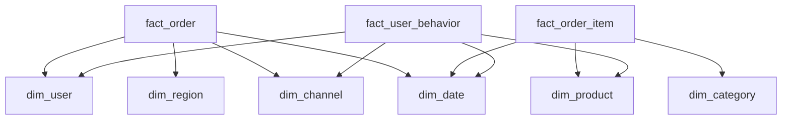
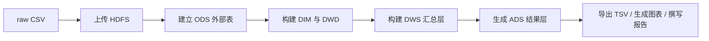

# 基于 Hive 的电商用户行为与订单分析数据仓库项目最终报告

## 摘要

本项目面向课程作业“方向 B：基于 Hive 的数据仓库设计与分析”，构建了一个围绕电商订单、商品、用户和访问行为的 Hive 数仓系统。项目主线覆盖数据建模、ETL、OLAP 查询、Hive SQL 到 MapReduce 执行逻辑理解、性能优化实验以及结果可视化展示。系统采用 `ODS -> DWD -> DWS -> ADS` 四层分层设计，形成了 `6` 张维度表、`3` 张主线事实表、`6` 个 DWS 汇总主题和 `8` 个 ADS 分析输出。

项目最终在 `x86_64 Linux` 远程服务器上，以 `Java 8 + Hadoop 3.1.0 + Hive 3.1.3` 的本地 CLI 模式完成真实跑批，并将 ADS 结果、benchmark 日志和图表全部回收到本地。最终实测结果显示：总支付销售额为 `237,144,839.88`，支付订单数为 `68,428`，支付用户数为 `7,982`；性能实验表明 `ORC` 相比 `TEXTFILE` 具有明显扫描优势，分区策略能够进一步缩小查询成本。该项目已完成作业要求中的完整数仓设计、五条以上 OLAP 分析、执行原理分析、性能优化和报告/PPT 交付。

## 1. 项目背景与作业要求分析

### 1.1 课程要求

课程方向 B 要求基于 Hive 构建一个面向业务分析的数据仓库系统，完成从数据建模、ETL 处理到分析查询的全流程设计，并结合 Hive SQL 的底层执行逻辑和性能优化方法，对不同技术方案的查询效果进行评估。作业明确要求：

- 设计一个完整数据仓库
- 至少建立 `3` 张事实表和维度表
- 实现 `5` 条以上 OLAP 分析查询
- 理解 `Hive SQL -> MapReduce` 的执行流程
- 报告中包含项目背景、系统架构设计、数据处理流程图、性能优化手段
- PPT 中展示核心代码逻辑、实践结果可视化和团队分工

### 1.2 评分点拆解

根据作业说明，评分重点包括：

- 技术深度 `40%`
- 系统稳定性 `20%`
- 报告质量 `20%`
- Pre 表现 `20%`

本项目对评分点的落地映射如下：

| 评分项 | 落地方式 |
| --- | --- |
| 技术深度 | 四层数仓建模、Hive ETL、`6` 类 OLAP、`3` 个 SQL 到 MapReduce 解释、`3` 组性能实验 |
| 系统稳定性 | 从小服务器失败切换到新服务器稳定跑通，保留运行日志、本地备份与执行状态记录 |
| 报告质量 | 提供系统架构图、数据流图、星型模型、实验结果表和问题分析 |
| Pre 表现 | 输出可视化图表、关键指标、团队分工、结果解释和优化结论 |

### 1.3 项目选题说明

本项目最终选题为：

**基于 Hive 的电商用户行为与订单分析数据仓库系统**

选择该题目的原因是其同时覆盖了课程要求中的关键能力：

- 分布式存储：HDFS
- 分布式计算：Hive
- 数据接口：CSV 导入、Python 模拟数据生成
- 数据建模：星型模型与数仓分层
- 分析查询：销售、品类、地区、转化漏斗、用户分层、热门商品
- 性能优化：ORC、分区、Join 策略、执行计划分析

## 2. 项目目标与业务场景

### 2.1 业务场景

项目模拟一个典型电商平台的业务过程，涵盖以下环节：

- 用户注册与用户属性维度
- 商品与品类信息维护
- 用户浏览、加购、下单与支付行为
- 不同地区和渠道的订单分布
- 新老用户消费差异与热门商品分析

该业务场景具备以下特点：

- 订单和行为链路完整，适合构建事实表
- 时间、地区、品类、渠道等维度明确，适合做多维分析
- 指标天然具有趋势性、排行性与转化性，适合课程展示

### 2.2 项目目标

项目将课程要求具体化为以下目标：

1. 建立 `ODS -> DWD -> DWS -> ADS` 四层 Hive 数仓。
2. 建立 `6` 张维度表与 `3` 张主线事实表。
3. 完成 `6` 类核心 OLAP 分析，并输出可视化结果。
4. 使用 `EXPLAIN` 和 SQL 逻辑说明 `Hive SQL -> MapReduce` 执行路径。
5. 对 `TEXTFILE vs ORC`、`非分区 vs 分区`、`普通 Join vs MapJoin` 进行性能实验。
6. 整理出可直接答辩使用的报告、PPT、结果表、图表和日志材料。

## 3. 系统架构与技术栈

### 3.1 总体架构

### 3.2 技术栈

设计技术栈如下：

- 数据生成：Python
- 分布式存储：HDFS
- 查询与数仓实现：Hive
- 结果整理与可视化：Python、pandas、matplotlib
- 可选对比：Impala bonus 查询

实际验证环境如下：

- 操作系统：Ubuntu 22.04.5 LTS（`x86_64`）
- Java：`8u482`
- Hadoop：`3.1.0`
- Hive：`3.1.3`
- 执行方式：本地 CLI + 本地 MapReduce

### 3.3 项目目录结构

核心目录如下：

- `data/raw/`：原始电商 CSV 数据
- `scripts/generator/`：模拟数据生成脚本
- `scripts/load/`：HDFS/Hive 主线执行脚本
- `scripts/server/`：远程服务器本地 CLI 跑批脚本
- `sql/00_init ~ sql/70_impala_bonus/`：Hive SQL 全流程
- `docs/`：数据字典、指标定义、运行说明、MapReduce 分析材料
- `results/metrics/`：导出的 ADS 结果与 benchmark 摘要
- `results/figures/`：图表素材
- `report/`：报告
- `presentation/`：PPT 与源文件

## 4. 数据来源与数仓建模设计

### 4.1 数据来源

本项目使用自建模拟电商数据，覆盖以下原始表：

- `users.csv`
- `products.csv`
- `categories.csv`
- `regions.csv`
- `channels.csv`
- `date_dim.csv`
- `orders.csv`
- `order_items.csv`
- `user_behavior.csv`

原始数据规模如下：

| 数据集 | 行数 |
| --- | ---: |
| users | 8,000 |
| products | 800 |
| categories | 30 |
| regions | 40 |
| channels | 8 |
| date_dim | 180 |
| orders | 80,000 |
| order_items | 141,785 |
| user_behavior | 573,784 |

### 4.2 四层分层设计

| 层级 | 作用 | 代表表 |
| --- | --- | --- |
| ODS | 承接原始 CSV，保留原始输入形态 | `ods_order`, `ods_order_item`, `ods_user_behavior` |
| DWD / DIM | 字段清洗、类型统一、维度标准化 | `fact_order`, `fact_order_item`, `dim_user` |
| DWS | 面向主题复用的汇总层 | `dws_sales_day`, `dws_category_sales`, `dws_region_sales` |
| ADS | 面向展示和答辩的结果层 | `ads_sales_trend_daily`, `ads_conversion_funnel` |

该分层的设计理由是：

- ODS 承接原始数据，便于回溯
- DWD 解决数据类型和口径统一问题
- DWS 减少 ADS 对大事实表的重复扫描
- ADS 直接服务图表、报告和答辩

### 4.3 星型模型

本项目采用星型模型，以订单、订单明细和行为日志作为中心事实表，维度表围绕用户、商品、品类、日期、地区和渠道展开。

### 4.4 事实表与维度表设计

维度表：

- `dim_user`
- `dim_product`
- `dim_category`
- `dim_date`
- `dim_region`
- `dim_channel`

主线事实表：

- `fact_order`
- `fact_order_item`
- `fact_user_behavior`

扩展表：

- `fact_payment`

其中 `fact_payment` 只作为扩展方案预留，不影响课程主线交付；核心要求已经由三张主线事实表满足。

## 5. ETL 流程与实现

### 5.1 ETL 主线

项目主流程如下：

### 5.2 SQL 执行顺序

1. `sql/00_init`
2. `sql/10_ods`
3. `sql/20_dim`
4. `sql/30_fact_dwd`
5. `sql/40_dws`
6. `sql/50_ads`
7. `sql/60_benchmark`
8. `sql/70_impala_bonus`（可选）

### 5.3 各层处理逻辑

ODS 层：

- 通过外部表读取 HDFS 中的原始 CSV
- 不做复杂业务逻辑，只承担原始承接

DWD / DIM 层：

- 将字符串字段转为标准数值、日期、金额与状态字段
- 建立标准维度表
- 将核心事实表写入分区 ORC

DWS 层：

- 围绕销售趋势、品类、地区、漏斗、新老用户、商品热度构建主题汇总表
- 把重复使用的统计逻辑前置，降低 ADS 层重复扫描

ADS 层：

- 输出给图表、报告和答辩直接使用的最终结果表
- 形成按日/周/月趋势、品类排行、地区对比、漏斗、新老用户对比和热门商品 Top N

### 5.4 存储与表结构策略

- DWD / DWS / ADS 层默认使用 `ORC + SNAPPY`
- 事实表按 `dt` 分区
- 使用动态分区写入
- 通过较小维表与事实表关联完成分析
- 通过 DWS 复用减少 ADS 重复扫描

## 6. 核心分析查询与业务结果

本节所有结果均基于真实远程 Hive 执行导出的 ADS 结果生成，主要来源为：

- `results/metrics/remote_seeta_local_cli_exports/*.tsv`
- `results/metrics/remote_seeta_summary.json`

### 6.1 销售趋势分析

对应结果表：

- `ads_sales_trend_daily.tsv`
- `ads_sales_trend_weekly.tsv`
- `ads_sales_trend_monthly.tsv`

核心结果：

- 总支付销售额：`237,144,839.88`
- 支付订单数：`68,428`
- 支付用户数：`7,982`
- 平均客单价：`3,465.61`
- 销售额峰值月份：`2026-01`
- 峰值月份销售额：`42,115,989.17`

结果解释：

- 整体销售趋势较平稳，但 2025 年 11 月、12 月和 2026 年 1 月处于高位
- 该分布符合模拟数据中设置的促销季和年末消费旺季特征
- 趋势分析说明日期维度和订单事实表设计能够支撑连续时间分析

### 6.2 品类销售排行

对应结果表：

- `ads_category_sales_rank.tsv`

核心结果：

- 销售额最高品类：`laptops`
- 销售额：`98,642,399.85`
- 销量：`11,700`
- Top 5 品类销售额占比：`78.77%`

结果解释：

- 销售额高度集中于少数高单价电子类商品
- 头部品类集中度明显，说明品类分析能支持库存、促销和推荐策略优化

### 6.3 地区订单量与销售额对比

对应结果表：

- `ads_region_order_sales.tsv`

核心结果：

- 销售额最高地区：`Beijing-Beijing`
- 销售额：`13,237,220.49`
- 支付订单数：`3,260`
- Top 5 地区销售额占比：`22.69%`

结果解释：

- 地区分布存在头部，但整体比品类更分散
- 该结果适合说明地区维度聚合适用于跨区域对比分析

### 6.4 浏览到支付漏斗分析

对应结果表：

- `ads_conversion_funnel.tsv`

核心结果：

| 阶段 | 去重用户数 | 相对浏览转化率 |
| --- | ---: | ---: |
| view | 7,993 | 100.00% |
| cart | 7,993 | 100.00% |
| order_submit | 7,993 | 100.00% |
| pay | 7,982 | 99.86% |

结果解释：

- 当前模拟数据采用强闭环行为链路，导致漏斗转化率异常高
- 该结果更适合用于说明漏斗指标计算逻辑，而不是用于真实业务诊断
- 答辩时应主动说明：这是模拟场景的预期现象，不应与真实电商平台自然转化率混淆

### 6.5 新老用户消费对比

对应结果表：

- `ads_new_old_user_compare.tsv`

核心结果：

| 用户类型 | 支付用户数 | 支付订单数 | 销售额 | 平均客单价 | 人均订单数 |
| --- | ---: | ---: | ---: | ---: | ---: |
| new_user | 2,784 | 18,261 | 63,810,603.23 | 3,494.37 | 6.56 |
| old_user | 5,198 | 50,168 | 173,334,293.17 | 3,455.08 | 9.65 |

结果解释：

- 老用户贡献了更多销售额，也是更稳定的营收来源
- 新用户平均客单价略高，但复购频率明显低于老用户
- 该结果说明用户维度设计能够支持用户价值分析

### 6.6 热门商品 Top N

对应结果表：

- `ads_hot_products_topn.tsv`

核心结果：

- Top 1 商品：`snacks_dailybite_0237`
- 销量：`1,311`
- 销售额：`116,982.42`

结果解释：

- 热门商品榜单同时包含高频低价商品和高价电子类商品
- “销量 Top N” 与 “销售额 Top N” 不一定一致，说明建立多指标分析体系是必要的

### 6.7 OLAP 要求完成情况

课程要求至少 `5` 条 OLAP 查询，本项目实际完成 `6` 类核心分析：

1. 销售额日/周/月趋势
2. 品类销量与销售额排行
3. 地区订单量与销售额对比
4. 浏览到支付漏斗转化
5. 新老用户消费对比
6. 热门商品 Top N

因此，项目在 OLAP 数量和业务覆盖度上均满足并超出作业要求。

## 7. Hive SQL 到 MapReduce 执行原理分析

本项目选取三条代表性 SQL 展示 Hive 的执行逻辑，详细材料已整理在 `docs/sql_to_mapreduce_notes.md`。

### 7.1 `fact_order_item` ETL 装载

代表 SQL：

- `sql/30_fact_dwd/32_fact_order_item.sql`

执行理解：

- Map 阶段读取 ODS 文本行，完成字段解析和类型转换
- Shuffle 阶段根据动态分区字段 `dt` 路由目标分区
- Reduce 阶段将结果写出为 ORC 分区文件

该 SQL 展示了 `ODS -> DWD` 不只是逻辑建表，更是从文本到列式存储的物理重写过程。

### 7.2 品类销售排行

代表 SQL：

- `sql/40_dws/42_dws_category_sales.sql`
- `sql/50_ads/52_ads_category_sales_rank.sql`

执行理解：

- Map 阶段过滤支付成功明细并以 `category_id` 为键输出
- Shuffle 阶段将相同 `category_id` 的记录汇聚到同一 Reducer
- Reduce 阶段计算销量、销售额和订单数
- ADS 层进一步用窗口函数完成排名

该 SQL 说明了 `GROUP BY` 与窗口函数背后依赖的聚合和重分发成本。

### 7.3 转化漏斗

代表 SQL：

- `sql/40_dws/44_dws_funnel_stage_user_cnt.sql`
- `sql/50_ads/54_ads_conversion_funnel.sql`

执行理解：

- Map 阶段根据 `behavior_type` 输出阶段和用户标识
- Shuffle 阶段为 `COUNT(DISTINCT user_id)` 聚合同一用户
- Reduce 阶段得到各阶段去重用户数
- ADS 层再计算相邻阶段和相对浏览阶段的转化率

该 SQL 说明漏斗分析本质上是去重用户统计问题，而非简单事件计数。

## 8. 性能优化、系统稳定性与实验结果

### 8.1 已实施优化策略

- 将 DWD / DWS / ADS 存储格式统一为 `ORC`
- 使用 `SNAPPY` 压缩减少扫描与存储开销
- 事实表按 `dt` 分区，降低时间范围查询成本
- 开启 `hive.auto.convert.join=true`，为小表关联提供 MapJoin 机会
- 将复杂聚合前置到 DWS 层，减少 ADS 重复扫描

### 8.2 三组性能实验实测结果

对应 SQL：

- `61_prepare_text_vs_orc.sql`
- `62_benchmark_text_vs_orc.sql`
- `63_prepare_nonpartition_fact_order.sql`
- `64_benchmark_partition_vs_nonpartition.sql`
- `65_benchmark_join_vs_mapjoin.sql`
- `66_explain_examples.sql`

实测结果如下：

| 实验组 | 方案 A | 方案 B | 实测耗时 |
| --- | --- | --- | --- |
| 文本存储 vs ORC | `TEXTFILE` | `ORC` | `2.844s` vs `1.392s` |
| 非分区 vs 分区 | `non_partition_orc` | `partition_orc` | `1.741s` vs `1.446s` |
| 普通 Join vs MapJoin | `regular_join` | `mapjoin` | `7.814s` vs `9.537s` |

结果分析：

- `ORC` 明显快于 `TEXTFILE`，说明列式存储对分析型场景有效
- 分区 ORC 优于非分区 ORC，证明时间分区在范围查询中的价值
- 本次 `MapJoin` 未快于普通 `Join`，说明优化策略必须结合实际数据规模和运行环境，而不能机械套用经验结论

### 8.3 系统稳定性与容错处理

项目联调实际经历了两个环境：

1. 老服务器 `43.135.178.197`
   - Docker 方案曾推进到 ADS 阶段
   - 但服务器资源过小，跑批过程中 SSH 频繁失联
   - 该环境最终被放弃，不作为最终交付结果来源
2. 新服务器 `connect.westc.seetacloud.com:51821`
   - 采用 `Java 8 + Hadoop 3.1.0 + Hive 3.1.3` 本地 CLI 方案
   - 成功完成 `sql/00_init` 到 `sql/60_benchmark` 的真实执行
   - 导出 `8` 张 ADS 结果表和 benchmark 日志

在联调过程中，项目解决了以下稳定性问题：

- 修复 Hive scratch 目录权限问题
- 通过显式设置 `HADOOP_HEAPSIZE`、`HIVE_HEAPSIZE` 降低本地 MapReduce 失败概率
- 调整 `mapreduce.task.io.sort.mb` 避免内存溢出
- 在本地 CLI 环境中关闭不必要的统计收集与 CBO，优先保证主线任务稳定跑通
- 将所有关键结果、日志和图表回收到本地，避免依赖远程服务器再次访问

这一部分直接回应了评分中的“系统稳定性”和“对容错机制的处理”要求。

## 9. 团队分工与协作方式

### 9.1 成员 B 的工作

- 业务场景与模拟规则设计
- 原始数据生成脚本
- 数据字典与字段说明
- 指标口径定义
- ER 关系与主外键说明

### 9.2 成员 A 的工作

- Hive 建库建表与分层 SQL 实现
- ODS / DWD / DWS / ADS 主线开发
- HDFS/Hive 加载脚本与远程跑批脚本
- SQL 到 MapReduce 执行逻辑说明
- 性能实验 SQL 与 benchmark 结果整理
- 图表、真实 ADS 结果、报告与 PPT 收口

### 9.3 协作方式

- 先由 B 侧确定业务规则、字段字典和指标口径
- A 侧在此基础上实现 Hive DDL、ETL 和分析 SQL
- 最终由双方共同完成联调、结果复核、报告收口与答辩准备

这种分工方式实现了“系统实现”和“业务分析”两条主线并行推进，较好体现了课程作业要求中的团队协作。

## 10. 不足与改进方向

尽管项目已经完成课程要求，但仍有以下可以继续优化的地方：

1. 漏斗数据为强闭环模拟，业务真实性不如真实平台日志丰富。
2. 最终稳定验证环境采用本地 CLI，而非完整 YARN UI 联动环境；如果时间允许，可继续补充 YARN 页面和执行截图。
3. `Impala` 仅作为 bonus 路线预留，未纳入最终主线实验对比。
4. 当前性能实验数据量仍属于课程项目规模，后续可扩展到更大数据集观察优化拐点。
5. 若继续完善，可补充分桶、压缩比、不同数据量下查询时延变化等高级实验。

## 11. 交付物清单

已完成的最终交付物包括：

- SQL 主线：`sql/00_init` 到 `sql/70_impala_bonus`
- 执行脚本：`scripts/load/` 与 `scripts/server/`
- 原始数据：`data/raw/*.csv`
- 真实 ADS 导出：`results/metrics/remote_seeta_local_cli_exports/*.tsv`
- 真实执行日志：`results/metrics/remote_seeta_logs/*.log`
- 结果摘要：`results/metrics/remote_seeta_summary.json`
- 图表：`results/figures/*.png`
- 报告：`report/Hive_Ecommerce_Data_Warehouse_Report.md`
- 演示材料：`presentation/Hive_Ecommerce_Data_Warehouse_Presentation.pptx`

本地还额外保留了独立备份包，避免后续交付依赖服务器环境。

## 12. 结论

本项目已经完整完成课程方向 B 的核心要求：

- 构建了完整 Hive 数仓
- 建立了 `3` 张主线事实表和 `6` 张维度表
- 实现了 `6` 类核心 OLAP 分析
- 解释了 `Hive SQL -> MapReduce` 的执行逻辑
- 完成了 `3` 组性能实验与优化分析
- 整理了可直接答辩使用的报告、PPT、图表、结果表和日志

从课程作业角度看，该项目已经具备“可运行、可解释、可展示、可回溯”的完整交付条件。更重要的是，最终报告和 PPT 均基于真实 Hive 跑批结果而非离线保底结果，因此能够较好支撑技术深度、系统稳定性和展示完整性的评分要求。

## 13. 参考资料

1. Apache Hive Documentation.
2. Apache Hadoop Documentation.
3. Apache HDFS Documentation.
4. Apache Impala Documentation.
5. Ralph Kimball, Margy Ross. *The Data Warehouse Toolkit*, 3rd Edition.
6. 课程作业说明与项目内部设计文档。
